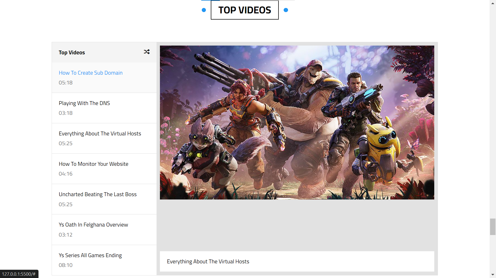

# Personal Blog
A website template for a personal blog. This project showcases a beautifully designed and highly animated blog template with smooth transitions and engaging animations. The website features a clean and **responsive layout**, ensuring an excellent browsing experience on all devices.

## Live Demo
if you want to experience it in action, please visit the following link: [Live Demo](https://minaanis7.github.io/personal-blog/)

## Features
- Header and Landing Page:
  - Header: Contains all the navigation links and mega menu that when hovering over the "Other Links" Link, it opens up on top of the content of the page.
  - Landing Page: An intro to the webpage with nice little animations.
  

- Articles Section:
  Contains all the articles typed by the author with a brief introduction of each article. Also, it has:
  - Heading with animation when it gets hovered.
  - Some smooth transitions and animations for each article.
  

- Gallery Section:
  It Gathers all The Images you want to show on your website.
  Highlights:
  - Spikes Separator
  - Flashing Animation
  

- Features Section:
  Highlights
  - Appealing Transition.
  

- Testimonials Section
  

- Team Members Section
  Highlights:
  - Filter Transition
  - Fill Transition
  

- Services Section
  Highlights:
  - Fill Transition
  - Spikes Separator
  

- Our Skills Section
  

- How It Works Section
  

- Latest Events
  

- Pricing Plans
  Highlights:
  - doted background
  - Fill Transition with different directions
  - Most Popular Mark for the Most Popular Plan
  

- Top Videos Section
  
  
- Statistics Section
  

- Discount Section
  

- Footer
  

## Languages and Libraries Used
- HTML
- CSS
- Font Awesome Free v6.6.0
- Normailze.css v8.0.1
